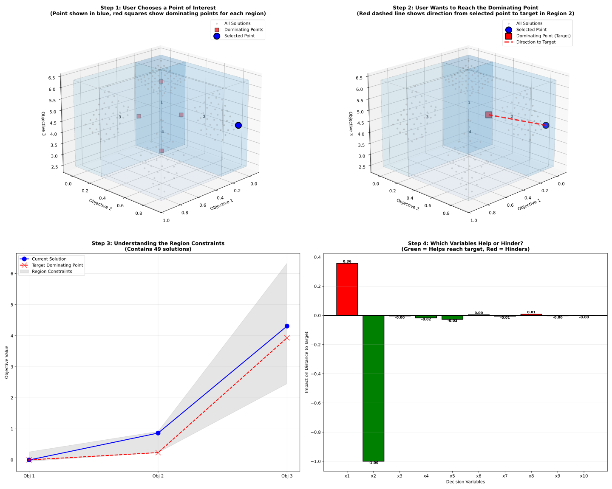

# Partition-Guided Distance Saliency (PGDS)

This repository contains the official implementation of the **Partition-Guided Distance Saliency (PGDS)** framework, as introduced in the paper: 

> **"Partition-Guided Distance Saliency: Bridging Decision and Objective Spaces in Many-Objective Optimization"**.



---

## Overview

Explainability in **Many-Objective Optimization (MaO)** is often hindered by a "cognitive drought" that occurs when the number of objectives exceeds traditional visualization limits.

**PGDS** bridges this gap by providing a continuous, geometry-aware explainability pipeline. Instead of relying on abstract rules that may lose geometric fidelity, PGDS quantifies how decision variables influence a solution's geometric proximity to automated targets in high-dimensional objective space.

---

## Key Features

* **Geometric Surrogate Modeling**: Utilizes the **Minimal Learning Machine (MLM)** to learn a distance-preserving mapping between decision and objective spaces.
* **Automated Target Discovery**: Employs **KD-Tree partitioning** to segment the objective landscape and identify local **"Dominating Points"** (local utopias) as automated targets.
* **Distance-Based Saliency**: Categorizes decision variables as **Drivers** (facilitate convergence) or **Blockers** (hinder progress) based on distance shifts.

---

## Project Structure

* `RegionExplainer.py`: Core Explainer class handling rule extraction, saliency calculation, and visualization plotting.
* `PartitionTree.py`: Implements the KD-Tree logic to build explicit partitions and find local ideal points.
* `KDNode.py`: Storage unit representing a hyperrectangle block in the objective space.
* `mlm.py` & `mlm_explainability.py`: Implementations of the Minimal Learning Machine for regression and distance explainability.
* `maskers.py` & `utils.py`: Utilities for generating interpolated masks and handling data arrays.
* `onnx_runner.py`: Simple runner for handling ONNX model inferences.

---

## Citation

If you find this work useful in your research, please cite:

```bibtex
@inproceedings{lopes2026pgds,
  title={Partition-Guided Distance Saliency: Bridging Decision and Objective Spaces in Many-Objective Optimization},
  author={Lopes, Cláudio L. and Martins, Flávio V. C. and Wanner, Elizabeth F.},
  year={2026}
}
```
